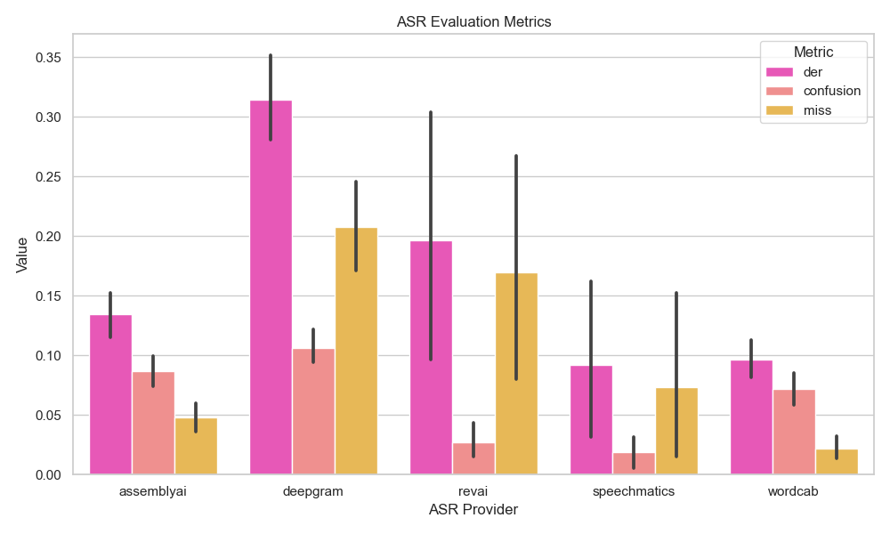

<h1 align="center">Rate That ASR (RTASR)</h1>

<div align="center">
	<a  href="https://pypi.org/project/rtasr" target="_blank">
		
	</a>
	<a  href="https://pypi.org/project/rtasr" target="_blank">
		
	</a>
	<a  href="https://github.com/Wordcab/rtasr/blob/main/LICENSE" target="_blank">
		
	</a>
	<a  href="https://github.com/Wordcab/rtasr/actions?workflow=ci-cd" target="_blank">
		
	</a>
	<a  href="https://github.com/pypa/hatch" target="_blank">
		
	</a>
</div>

<p align="center"><em>🏆 Run benchmarks against the most common ASR tools on the market.</em></p>

---

## Installation

### Last stable version

```bash
pip install rtasr
```

### From source

```bash
git clone https://github.com/Wordcab/rtasr
cd rtasr

pip install .
```

## Commands

The CLI is available through the `rtasr` command.

```bash
rtasr --help
```

### List datasets, metrics and providers

```bash
# List everything
rtasr list
# List only datasets
rtasr list -t datasets
# List only metrics
rtasr list -t metrics
# List only providers
rtasr list -t providers
```

### Datasets download

Available datasets are:

* `ami`: [AMI Corpus](http://groups.inf.ed.ac.uk/ami/corpus/)
* `voxconverse`: [VoxConverse](https://www.robots.ox.ac.uk/~vgg/data/voxconverse/)

```bash
rtasr download -d <dataset>
```

### ASR Transcription

#### Providers

Implemented ASR providers are:

* [x] `assemblyai`: [AssemblyAI](https://www.assemblyai.com/)
* [ ] `aws`: [AWS Transcribe](https://aws.amazon.com/transcribe/)
* [ ] `azure`: [Azure Speech](https://azure.microsoft.com/en-us/services/cognitive-services/speech-to-text/)
* [x] `deepgram`: [Deepgram](https://www.deepgram.com/)
* [ ] `google`: [Google Cloud Speech-to-Text](https://cloud.google.com/speech-to-text)
* [x] `revai`: [RevAI](https://www.rev.ai/)
* [x] `speechmatics`: [Speechmatics](https://www.speechmatics.com/)
* [x] `wordcab`: [Wordcab](https://wordcab.com/)

#### Run transcription

Run ASR transcription on a given dataset with a given provider.

```bash
rtasr transcription -d <dataset> -p <provider>
```

#### Multiple providers

You can specify as many providers as you want:

```bash
rtasr transcription -d <dataset> -p <provider1> <provider2> <provider3> ...
```

#### Choose dataset split

You can specify the dataset split to use:

```bash
rtasr transcription -d <dataset> -p <provider> -s <split>
```

If not specified, all the available splits will be used.

#### Caching

By default, the transcription results are cached in the `~/.cache/rtasr/transcription` directory for each provider.

If you don't want to use the cache, use the `--no-cache` flag.

```bash
rtasr transcription -d <dataset> -p <provider> --no-cache
```

_Note: the cache is used to avoid running the same file twice. By removing the cache, you will run the transcription on the whole dataset again. We aren't responsible for any extra costs._

#### Debug mode

Use the `--debug` flag to run only one file by split for each provider.

```bash
rtasr transcription -d <dataset> -p <provider> --debug
```

### Evaluation (🚧 WIP)

The `evaluation` command allows you to run an evaluation on the transcription results.

#### Run DER evaluation

Specify the dataset to use:

```bash
rtasr evaluation -m der -d <dataset> -s <split>
```

## DER Results

As a first evaluation, we ran the `der` metric on the `voxconverse` dataset using only the `test` split.

__AssemblyAI__, __Deepgram__, and __Wordcab__ were evaluated almost on the whole split (224 files) while __RevAI__ and __Speechmatics__ were evaluated respectively on 29 and 7 files, due to respective API limitations and issues for Speechmatics...

Here are the results:




## Contributing

Be sure to have [hatch](https://hatch.pypa.io/latest/install/) installed.

### Quality

* Run quality checks: `hatch run quality:check`
* Run quality formatting: `hatch run quality:format`

### Testing

* Run tests: `hatch run tests:run`
