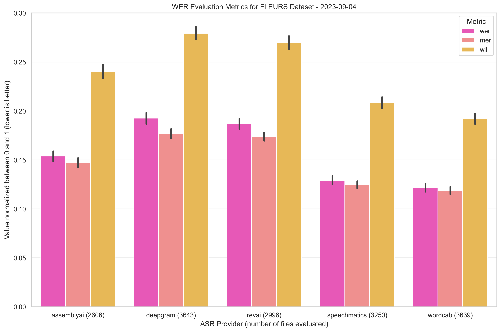
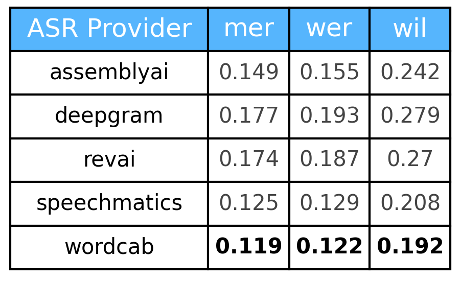
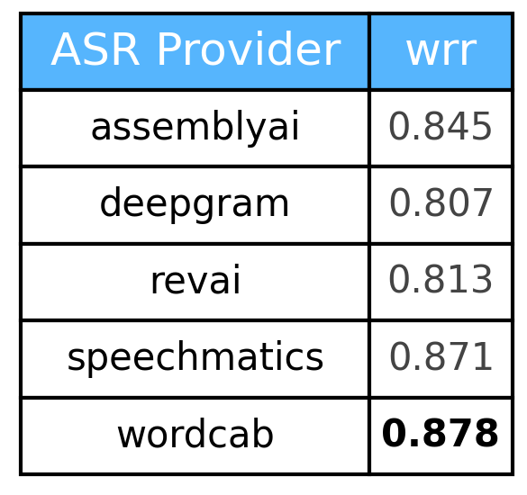
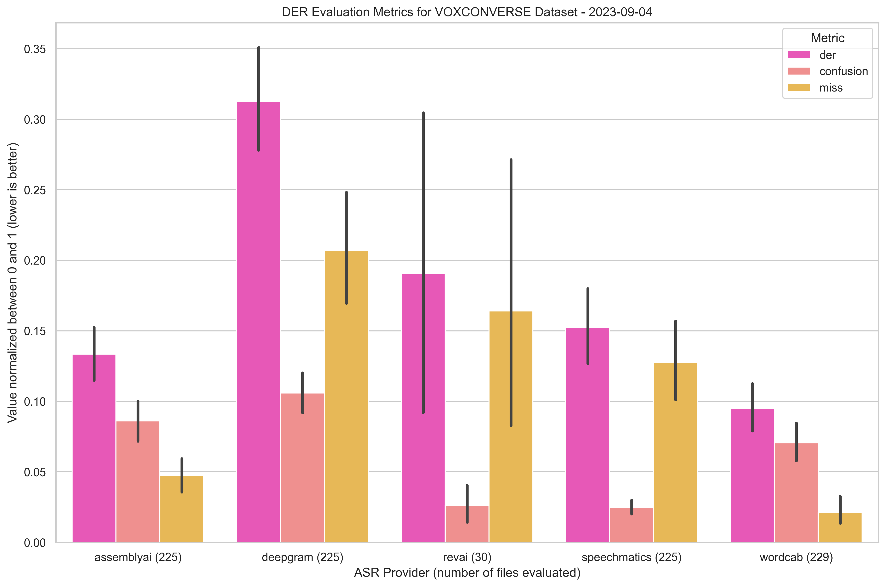
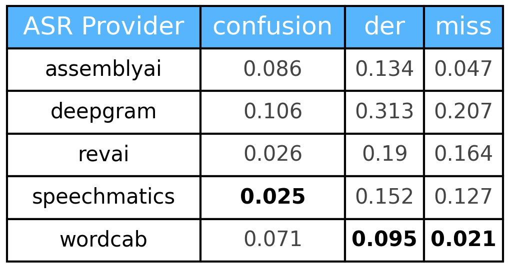
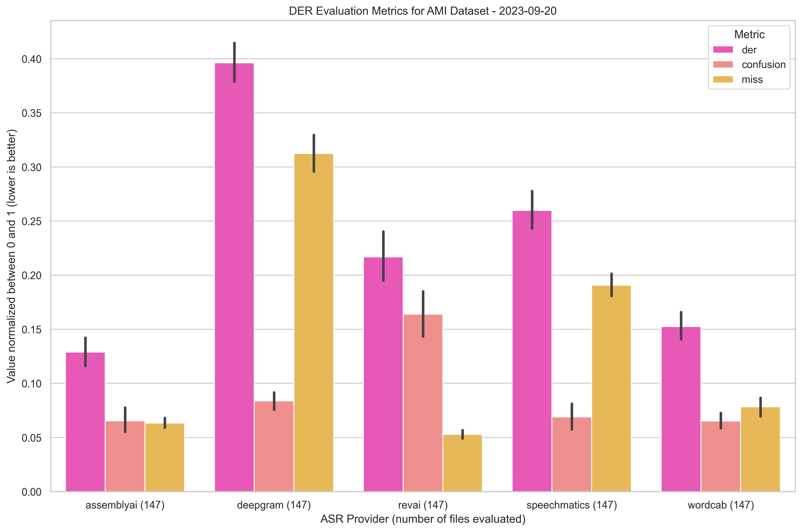
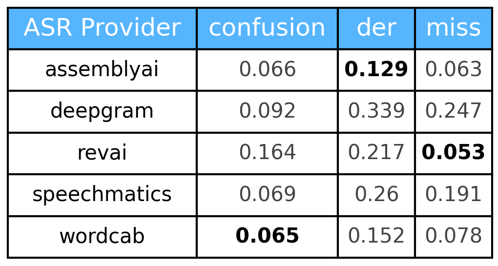

<h1 align="center">Rate That ASR (RTASR)</h1>

<div align="center">
	<a  href="https://pypi.org/project/rtasr" target="_blank">
		
	</a>
	<a  href="https://pypi.org/project/rtasr" target="_blank">
		
	</a>
	<a  href="https://github.com/Wordcab/rtasr/blob/main/LICENSE" target="_blank">
		
	</a>
	<a  href="https://github.com/Wordcab/rtasr/actions?workflow=ci-cd" target="_blank">
		
	</a>
	<a  href="https://github.com/pypa/hatch" target="_blank">
		
	</a>
</div>

<p align="center"><em>🏆 Run benchmarks against the most common ASR tools on the market.</em></p>

---

## Results

> [!IMPORTANT]\
> Deepgram benchmark results have been updated with the latest Nova 2 model.

### WER & WRR

`wer` = Word Error Rate, `mer` = Match Error Rate, `wil` = Word Information Lost, `wrr` = Word Recognition Rate


* Dataset: [Fleurs](https://huggingface.co/datasets/google/fleurs)



<div style="display: flex; justify-content: space-between;">
    
    
</div>


### DER

`der` = Diarization Error Rate, `miss` = missed detection, `confusion` = incorrect detection, `fa` = false alarm

* Dataset: [VoxConverse](https://www.robots.ox.ac.uk/~vgg/data/voxconverse/)

> [!NOTE]\
> Click on the images to get a bigger display.

<div style="display: flex; justify-content: space-between;">
    
    
</div>

* Dataset: [AMI Corpus](http://groups.inf.ed.ac.uk/ami/corpus/)

> [!NOTE]\
> Click on the images to get a bigger display.

<div style="display: flex; justify-content: space-between;">
    
    
</div>


## Installation

### Last stable version

```bash
pip install rtasr
```

### From source

```bash
git clone https://github.com/Wordcab/rtasr
cd rtasr

pip install .
```

## Commands

The CLI is available through the `rtasr` command.

```bash
rtasr --help
```

### List datasets, metrics and providers

```bash
# List everything
rtasr list
# List only datasets
rtasr list -t datasets
# List only metrics
rtasr list -t metrics
# List only providers
rtasr list -t providers
```

### Datasets download

Available datasets are:

* `ami`: [AMI Corpus](http://groups.inf.ed.ac.uk/ami/corpus/)
* `voxconverse`: [VoxConverse](https://www.robots.ox.ac.uk/~vgg/data/voxconverse/)

```bash
rtasr download -d <dataset>
```

### ASR Transcription

#### Providers

Implemented ASR providers are:

* [x] `assemblyai`: [AssemblyAI](https://www.assemblyai.com/)
* [ ] `aws`: [AWS Transcribe](https://aws.amazon.com/transcribe/)
* [ ] `azure`: [Azure Speech](https://azure.microsoft.com/en-us/services/cognitive-services/speech-to-text/)
* [x] `deepgram`: [Deepgram](https://www.deepgram.com/)
* [ ] `google`: [Google Cloud Speech-to-Text](https://cloud.google.com/speech-to-text)
* [x] `revai`: [RevAI](https://www.rev.ai/)
* [x] `speechmatics`: [Speechmatics](https://www.speechmatics.com/)
* [x] `wordcab`: [Wordcab](https://wordcab.com/)

#### Run transcription

Run ASR transcription on a given dataset with a given provider.

```bash
rtasr transcription -d <dataset> -p <provider>
```

#### Multiple providers

You can specify as many providers as you want:

```bash
rtasr transcription -d <dataset> -p <provider1> <provider2> <provider3> ...
```

#### Choose dataset split

You can specify the dataset split to use:

```bash
rtasr transcription -d <dataset> -p <provider> -s <split>
```

If not specified, all the available splits will be used.

#### Caching

By default, the transcription results are cached in the `~/.cache/rtasr/transcription` directory for each provider.

If you don't want to use the cache, use the `--no-cache` flag.

```bash
rtasr transcription -d <dataset> -p <provider> --no-cache
```

_Note: the cache is used to avoid running the same file twice. By removing the cache, you will run the transcription on the whole dataset again. We aren't responsible for any extra costs._

#### Debug mode

Use the `--debug` flag to run only one file by split for each provider.

```bash
rtasr transcription -d <dataset> -p <provider> --debug
```

### Evaluation

The `evaluation` command allows you to run an evaluation on the transcription results.

If you don't specify the split, the evaluation will be run on the whole dataset.

#### Run DER evaluation

```bash
rtasr evaluation -m der -d <dataset> -s <split>
```

#### Run WER evaluation

```bash
rtasr evaluation -m wer -d <dataset> -s <split>
```

### Plot results

To get the plots of the evaluation results, use the `plot` command.

If you don't specify the split, the plots will be generated for all the available splits.

#### Plot DER results

```bash
rtasr plot -m der -d <dataset> -s <split>
```

#### Plot WER results

```bash
rtasr plot -m wer -d <dataset> -s <split>
```

### Dataset length

To get the total length of a dataset, use the `audio-length` command.
This command allow you to get the number of minutes of audio for each split of a dataset.

If you don't specify the split, the total length of the dataset will be returned
for all the available splits.

```bash
rtasr audio-length -d <dataset> -s <split>
```

## Contributing

Be sure to have [hatch](https://hatch.pypa.io/latest/install/) installed.

### Quality

* Run quality checks: `hatch run quality:check`
* Run quality formatting: `hatch run quality:format`

### Testing

* Run tests: `hatch run tests:run`
